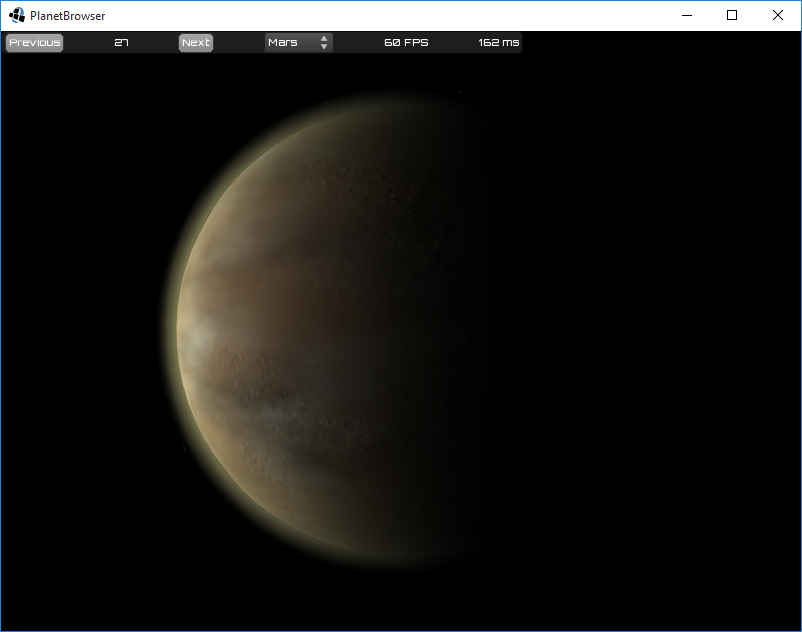

# planet-browser

A browser for random generated planets.

This application is intended as a showcase and testing environment for the rendering of random generated planets.

The same rendering algorithms will be used in the game InfiniteSpace.

## Screenshot Gallery

 
 
 
 
 
 
 
 
 
 
 
 
 

## Setup Eclipse Development

Prerequisites:
* Install Eclipse
* Install Android Studio
* Set environment variable ANDROID_HOME to the path of the Android SDK

In Eclipse or command line: 
* Clone the repository

In command line:
* Go to the working directory of the git repository
* `./gradlew`
* `./gradlew eclipse`

In Eclipse:
* Import projects from working directory of the git repository
* Add `assets` directory as source directory (if necessary)
* Locate class `DesktopLauncher` and execute context menu: `Run as...` / `Java Application`
